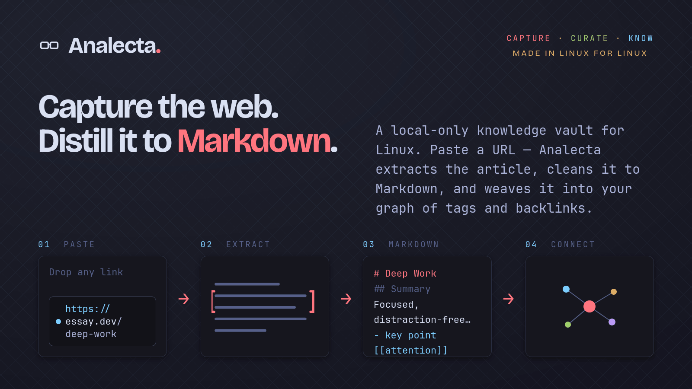
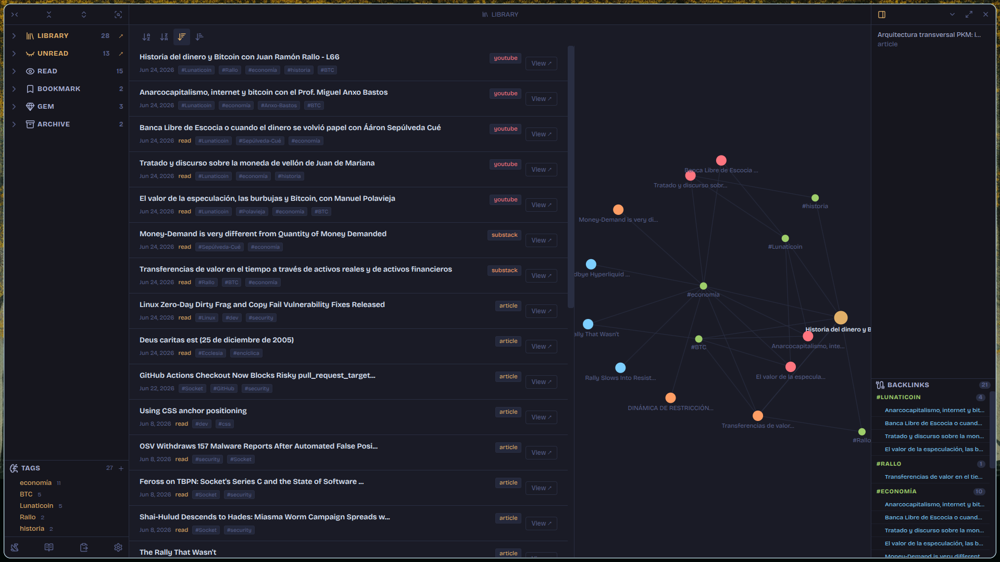
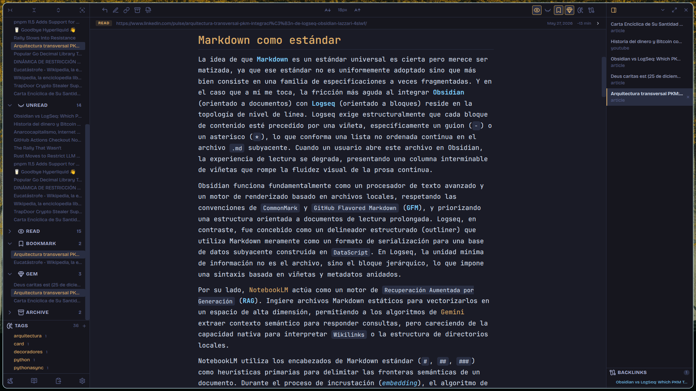
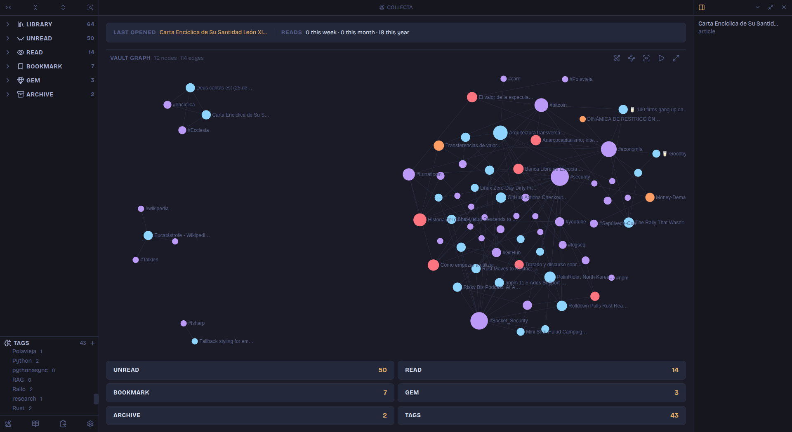

# Analecta

Save web content as clean Markdown. Read, annotate, and explore connections — entirely locally.

Analecta is a local Linux desktop application that turns any URL — article, YouTube video, Substack post — into a clean Markdown file stored in your personal vault. No cloud sync, no subscription, no tracking. Entirely private.

## Features

- **Web extraction** — paste a URL (`Ctrl+L`) to extract the main content as clean Markdown. Supports articles, YouTube transcripts, and Substack posts.
- **Local vault** — every entry is saved as a Markdown file in a directory you control, compatible with Logseq and other PKM tools.
- **Reading library** — organize entries by status: Unread, Read, Bookmark, Gem, Archive.
- **Full-text search** — fast search across titles and content (`Ctrl+K`), powered by SQLite FTS5.
- **Tags & backlinks** — hierarchical tag tree and automatic Linked Mentions across your vault.
- **Knowledge graph** — interactive vault-wide graph and per-entry subgraph, built with Sigma.js.
- **Markdown editor** — built-in editor with CodeMirror 6 and Tokyo Night theme.
- **Multi-tab reading** — open multiple entries in tabs; scroll positions are preserved across sessions.
- **Auto-updates** — new releases are delivered automatically via the in-app updater.

## Screenshots

| Dashboard | Reading view |
|----------|-------------|
|  |  |

## Download

Download for Linux from the [Releases page](https://github.com/E-zequiel/analecta/releases/latest).

| Format | Recommended for |
|--------|----------------|
| `.deb` | Debian, Ubuntu, Pop!\_OS, Linux Mint |
| `.rpm` | Fedora, openSUSE, RHEL |
| `.AppImage` | Any Linux distribution |

**Requirements:** Linux x86\_64, Wayland or X11.

**GNOME users:** the system tray requires the [AppIndicator and KStatusNotifierItem Support](https://extensions.gnome.org/extension/615/appindicator-support/) GNOME Shell extension. KDE, i3, and Sway work out of the box.

## Build from source

See [CONTRIBUTING.md](.github/CONTRIBUTING.md) for environment setup, build instructions, and contribution guidelines.

## Architecture

Analecta is a hybrid desktop application: an Electron shell manages the window and native OS integration; a bundled Python sidecar (FastAPI + uvicorn, packaged with PyInstaller) handles web extraction and local storage via SQLite; a SvelteKit frontend runs in the renderer process. All communication between frontend and sidecar goes over HTTP on a dynamic loopback port — no data leaves the machine.

## Security

To report a vulnerability, see [SECURITY.md](.github/SECURITY.md).

## License

MIT — see [LICENSE](LICENSE).
